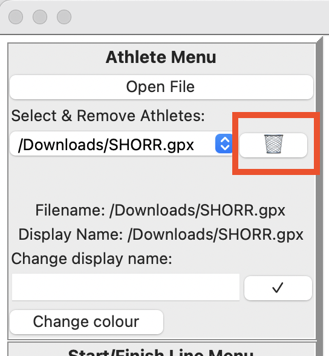
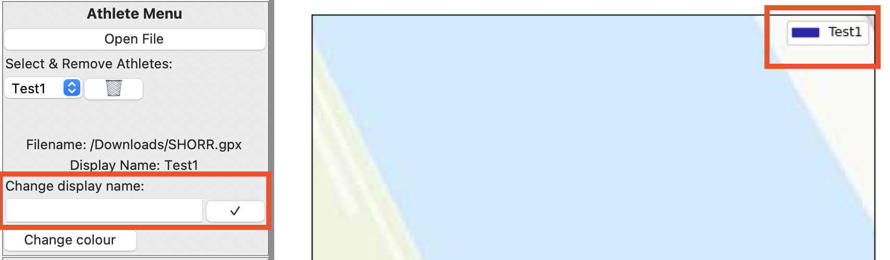
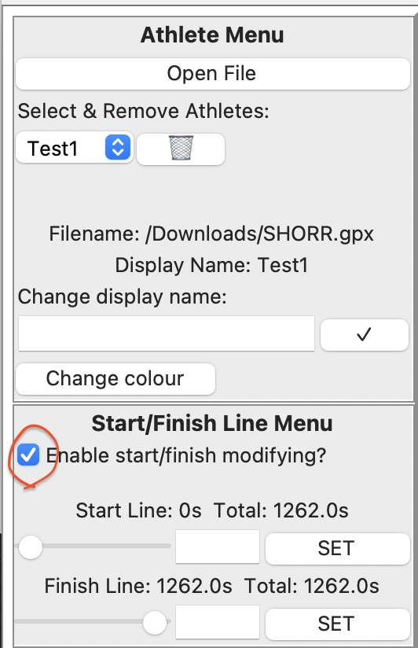
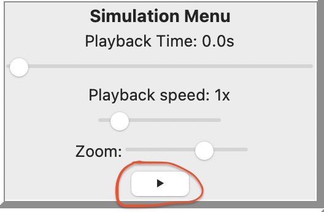
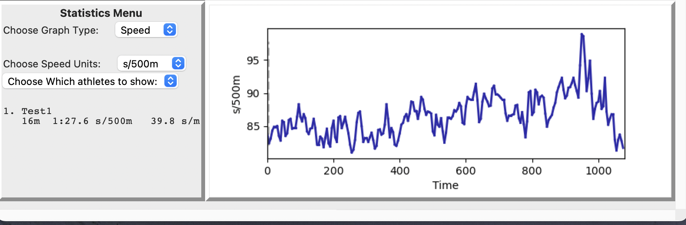

# Getting started : GPX Analysis

This guide will walk you through the installation and basic functions of the program

## Installation
The recommended way to install the program is via pip. This means you must have a python interpreter installed on your 
PC and pip must be configured; you can test if pip is working by running in your terminal ```pip help```.

If pip is installed correctly you can run ```pip install gpx_analysis_edf1101``` To test it works, run it by executing 
```python -m gpx_analysis```

If pip is working but you get errors when you try to install the gpx_analysis_edf1101 module this may be because you are on an older version of python. This module **requires python 3.11 +**. To check your version you can run ```python -V``` in the terminal

## Finding GPX Files

The best way of doing this is finding an activity on strava and using this tool https://mapstogpx.com/strava/ to download it
you can then open that GPX file in the GPX Analysis program. Make sure when you download a track you click the download all extensions button otherwise rate may be missing.


## Usage
The basic layout of the program has menus on the left column and visual displays on the right.

There are 4 menus: Athlete menu, Start & Finish menu, Simulation menu, and Stats Menu

There are 2 visual displays, The top is the Map which displays the path and position of all athletes loaded in the 
program. The bottom half contains a graph displaying various statistics about the athletes over time

### Athlete Menu
From here on GPX tracks imported are referred to as athletes, this menu relates to modifying their basic features such as
name, colour display along with adding and removing new ones.
#### Adding athletes
To add an athlete you click the "Open File" button. The file must be a valid GPX file (explained later) or the program may crash.


You cannot open the same file if it is already open, if you do so it just won't load into the program. Each time you open a new file
It will be added to the dropdown menu below, each time you do add an athlete the dropdown menu will reset to its default position.
#### Removing athletes
If you want to remove an athlete from the simulation you must make sure the dropdown menu has selected the athlete you want to remove then press the Bin Button



#### Display Names
The display name for an athlete is what is shown in the Dropdown menus for selection as well as in the map legend.
By default it is the GPX filename, but it can be changed to something shorter/recognisable.



In the above image we have changed the display name to Test1, you do this by typing into the highlighted entry box, and then clicking the tick button

#### Changing colour
If you want to change an athlete's marker colour to represent a club etc then you can do so by pressing the Change colour button at the bottom of the athlete menu.

### Start/Finish line menu
As this program compares different athletes doing different time trials they are likely to start and finish in different places,
this isn't ideal as we want to compare them side by side across the same distance. This menu allows you to modify the start and end of their
GPS recordings so the two athletes start side by side.


In this case the orange track stars far ahead of the blue one so we want to modify the blue one to start at the same place

To do that we make sure the track we want to modify is selected in the dropdown selector in the athlete menu and that the simulation is not playing.
We can then tick the Enable start/finish modifying checkbox.



After this you can drag the Slider to move the start/ finish roughly where you want it. Or you can use the Entry box to type in a more precise amount in seconds then press SET.
You only need to press SET if you are typing in a precise number.
You can only enter integers or decimal numbers, no text or spaces.

If it doesn't seem to be working make sure the Checkbox is selected, the right athlete is selected, and you aren't trying to move the start time after the finish time and vica versa.

### Simulation menu

The simulation menu relates to the playback of the simulation.

#### Pausing & Playing
To pause or play the simulation you click the pause/ play button at the bottom of the screen.



If it shows a play sign that means it is currently paused and you can click to play it. If it shows a pause sign that means its currently playing and you can click to pause.

#### Playback time and Speed
You can use the big slider below the text "Playback Time: ..." to move the map to a different point in time in the race.
You cannot do this while the simulation is running though. The playback time text denotes how far through the simuation it is currently.

The playback speed label and slider denotes how fast you want to go through the simulation. Since races can be quite long you may want to speed it up. 
This ranges from 0.1x speed to 10x speed.

#### Zooming and view of the simulation
The map will always zoom in and out so it keeps all of the opened athletes in the map view, eg. it zooms out if one is far ahead of the other.
You can adjust this slider to zoom in/or out more if you wish from this, but it will still always have both athlets in frame automatically.
NB: the further you zoom out the slower it is to run.


### Statistics Menu and Graph



The stats menu (and graph) display statistics about the athletes in the scene.

The text at the bottom of the statistics menu shows the athlete(s) Current distance, speed and rate (cadence), If there are more than 1 athlete they are ordered by current distance

The graph on the right shows the statistics about the selected athlete(s) across the whole race so you can find strengths or weaknesses.
#### Changing The graph type

The choose graph type Dropdown allows you to Choose a specific type of graph to display. There are 5 Kinds

Speed: Shows the athlete(s) speed over the race

Distance: Shows the athlete(s) distance over the race

Gap: Shows the gap to the leader for all athlete(s) over the race

Rate: Shows the athlete(s) rate for the race

Rate & Speed: Shows the athlete(s) speed over the race on one axis and rate on the other so you can analyse that.

#### Changing The speed units

A runner may want their pace in s/km or mph while a rower would want their pace in s/500m you can change the units by using the 'Choose speed Units' dropdown menu

#### Selecting athlete(s) to show on the graph
You can use the dropdown checkbox "Choose which athletes to show" to select which athletes you want to monitor on the graph so it doesn't get too cluttered.


## Common Issues
#### No Cadence
When you download the GPX track you must make sure you download the version with ALL extensions.

If this still doesn't work that may be because not all devices measure cadence


